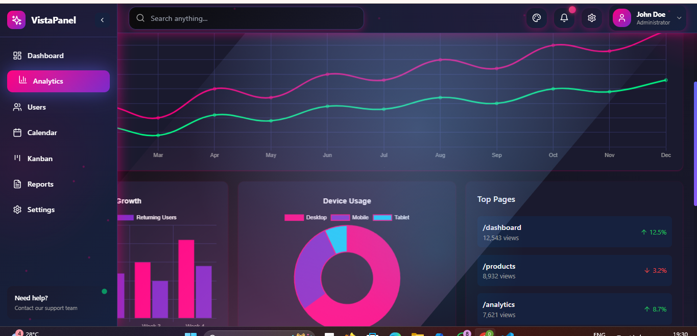
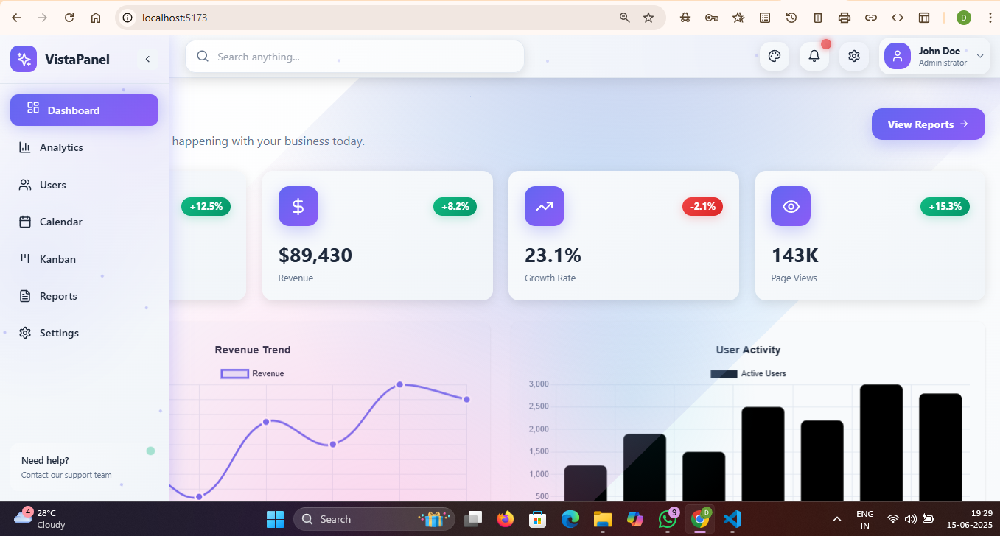
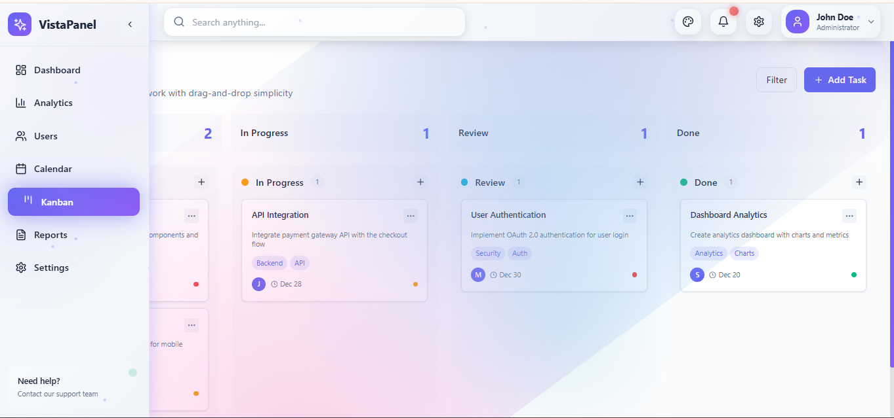

# 📊 Report Dashboard — VistaPanel

A modern, beautiful, and responsive **React Admin Dashboard** built with **Vite**, **Tailwind CSS**, and custom React components for charts, calendar, and theming. Designed to impress in internships, hackathons, or production use.

> ⚡ Built for speed, scalability, and modern UI needs. Ideal for analytics, admin portals, or reporting dashboards.

---

## 🚀 Features

- 🌙 Dark / Light theme toggle  
- 📊 **Custom Chart component** using Chart.js  
- 🗓️ **Manually built Calendar** using `date-fns`  
- 📌 **Kanban board** with drag-and-drop using `react-beautiful-dnd`  
- 🧩 Fully responsive layout  
- ⚙️ Sidebar + Topbar navigation  
- ⚡ Built with Vite for instant load & HMR  
- 🎯 Resume-worthy code and UI polish  
- ✅ Ready for deployment on Netlify/Vercel  

---

## 📸 Preview


<br/>

<br/>


---

## 🧱 Tech Stack

| Layer       | Technology                  |
|-------------|------------------------------|
| Framework   | React + Vite                 |
| Styling     | Tailwind CSS                 |
| Charts      | Chart.js + `react-chartjs-2` |
| Calendar    | `date-fns` (manual build)    |
| DnD Board   | `react-beautiful-dnd`        |
| Icons       | `lucide-react`               |
| State Mgmt  | Context API                  |

---

## 💻 Getting Started

### 1. Clone the repository

```bash
git clone https://github.com/your-username/report_dashboard.git
cd report_dashboard
```

### 2. Install Dependencies

```bash
npm install
```

### 3. Start the development server

```bash
npm run dev
```
Open `http://localhost:5173` in your browser.

### 4. Build for Production

```bash
npm run build
```

Deploy the **dist/ folder** to Netlify, Vercel, or any static hosting platform.

---

## 🌐 Deployment
You can deploy this dashboard on platforms like:

**Vercel**

**Netlify**

**Render**

Just connect your GitHub repo and set the build command to npm run build and output folder to dist.

---

## 🚀 Performance Highlights (Lighthouse Audit)

The deployed dashboard on [Vercel](https://your-project.vercel.app) was analyzed using Chrome Lighthouse.

| Metric                    | Score         |
|---------------------------|---------------|
| First Contentful Paint    | 0.6 s ✅       |
| Largest Contentful Paint  | 0.7 s ✅       |
| Total Blocking Time       | 580 ms ⚠️     |
| Cumulative Layout Shift   | 0.00 ✅       |
| Speed Index               | 2.3 s ✅       |
| SEO                       | 90+ ✅        |
| Accessibility             | 87 ✅         |
| Best Practices            | 100 ✅        |

> 📊 Dashboard achieves consistently fast load times and meets core web vitals benchmarks. Optimizations include lazy loading, Tailwind CSS purging, and Vite-based bundling.

---

## 📬 Contact

For any questions or feedback:

- **📧 Email**: [patil.dhanashrik@gmail.com](mailto:patil.dhanashrik@gmail.com)  
- **🐙 GitHub**: [DhanashriPatil11](https://github.com/DhanashriPatil11)  
- **🔗 LinkedIn**: [Dhanashri Patil](https://www.linkedin.com/in/dhanashri-patil24/)

---
